# FuncHole 

FuncHole is an open-source, self-hosted platform for gateway-hosted function execution. This repository contains the backend foundation for the platform: management APIs, HTTPS ingress, certificate lifecycle, and the early execution architecture.


> Wireframe only. The image above is a product-direction screenshot, not the current shipped interface.

## Overview

FuncHole is being shaped around a simple request model:

```text
https://<gateway-key>.<domain>/<path>
```

Example:

```text
https://gw1.example.com/orders
```

The hostname belongs to the gateway. Functions and future flows are resolved under that gateway by path.

## Current Status

As of September 10, 2026, the backend is still in active foundation work. Core pieces are already running, but the platform is not feature-complete yet.

Implemented today:

* Spring Boot `controlplane` for management APIs
* raw Netty `gateway` for HTTPS ingress
* Flyway-managed PostgreSQL schema
* JWT-based authentication
* domain creation and TXT-based verification
* gateway creation under verified domains
* shared certificate module
* self-signed certificate generation for local development
* OpenBao-backed secret storage for certificate material
* in-memory gateway TLS registry with short polling refresh
* Invocation Registry with immutable dependency snapshot persistence
* NATS + JetStream `INVOCATION_READY` publication
* standalone `dispatcher` consumer that validates the snapshot and plans the first executable step
* durable, idempotent `InvocationStepExecution` records (`READY`, attempt tracking) so JetStream redelivery cannot double-create execution intent
* standalone `runtime-registry` module: in-memory runtime capacity registration, compatibility filtering, and deterministic (least-in-flight) selection with reservation/release
* dispatcher selects and reserves runtime capacity via the Runtime Registry before ACK-ing an invocation

Not implemented yet:

* flow execution / actual Function invocation
* step progression beyond the first step (no next-step, branching, or Sub-Flow execution yet)
* IPC and the runtime worker protocol
* durable/distributed runtime reservation (Runtime Registry state today is in-memory per dispatcher process only)
* production ACME / Let's Encrypt flow
* automatic host-machine DNS setup for custom local domains

## Why FuncHole

Most serverless platforms tightly couple deployment, routing, runtime behavior, and infrastructure ownership to a single provider.

FuncHole is exploring a different model:

* self-hosted
* gateway-first
* path-based function exposure under stable gateway hosts
* framework-independent shared modules where practical
* explicit boundaries between management, ingress, invocation, and runtime

## Architecture At A Glance

```text
Controlplane         -> owns auth, domains, gateways, certificates, flows, metadata
Gateway              -> resolves request host/path to the Flow that should be invoked
Invocation Registry  -> freezes the immutable Flow/dependency graph for one invocation
NATS + JetStream     -> coordinates distributed components globally
Invocation Dispatcher -> chooses the next executable step and requests runtime capacity
Runtime Registry     -> prepares/selects runtime and artifact capacity
IPC                  -> carries local hot-path execution messages
Runtime / Artifact   -> executes the selected component version
```

Architectural principle:

> Global coordination is event-driven; local execution is IPC-driven.

```mermaid
flowchart LR
    client["Client Request"]
    gateway["Gateway"]
    registry["Invocation Registry"]
    jetstream["NATS JetStream"]
    dispatcher["Invocation Dispatcher"]
    runtimeRegistry["Runtime Registry"]
    ipc["IPC"]
    runtime["Runtime / Artifact"]

    client --> gateway
    gateway -->|"Which Flow should this request invoke?"| registry
    registry -->|"Invocation ready: invocationId"| jetstream
    jetstream --> dispatcher
    dispatcher -->|"What executes next?"| runtimeRegistry
    runtimeRegistry -->|"Local execution target"| ipc
    ipc --> runtime
    runtime --> ipc
    ipc --> dispatcher
    dispatcher -->|"Completion state"| registry
    registry -->|"Invocation completed/failed"| jetstream
    jetstream -->|"Completion notification"| gateway
    gateway --> client
```



NATS + JetStream is the global coordination layer. JetStream is used for durable invocation lifecycle and state-transition events where delivery must survive consumer or service restarts, such as invocation ready, invocation completed, and invocation failed.

JetStream events should primarily identify the invocation, for example with an `invocationId`. The complete dependency graph should not be sent through JetStream. The Invocation Registry remains the durable source of truth for the immutable Flow version, dependency graph, pinned component versions, invocation status, and result state.

```text
Invocation Registry
        │
        │ invocationId
        ▼
   NATS JetStream
        │
        ▼
Invocation Dispatcher
        │
        │ load immutable invocation snapshot
        ▼
Invocation Registry
```

NATS + JetStream is not a replacement for IPC. IPC is not intended to become the global distributed communication mechanism. NATS + JetStream provides durable, decoupled global coordination between services and nodes. IPC remains the optimized local execution path between runtime-facing components and prepared runtimes/artifacts.

Additional event schemas, NATS subjects, stream names, advanced consumer configuration, retention policies, retry counts, scheduling algorithms, and runtime persistence details are future design work. They are intentionally not decided by this README.

More detailed architecture notes live in [docs/architecture.md](docs/architecture.md).

## Repository Layout

```text
funchole/
├── certificate/
├── controlplane/
├── core/
├── docker/
├── docs/
├── gateway/
├── invocation/
├── dispatcher/
├── runtime-registry/
├── runtime/
├── Dockerfile
├── docker-compose.yml
├── docker-compose.dev.yml
└── image.png
```

## Modules

| Module | Responsibility |
| --- | --- |
| `certificate` | Framework-independent certificate contracts, models, and generators |
| `controlplane` | Spring Boot management API |
| `core` | Shared pagination, exception, response, and mapper concerns |
| `gateway` | Standalone raw Netty HTTPS ingress service |
| `invocation` | Invocation persistence, immutable dependency snapshots, and ready-event publication |
| `dispatcher` | Standalone JetStream consumer: validates the snapshot, plans the next step, persists durable step-execution intent, and requests runtime capacity |
| `runtime-registry` | In-memory runtime capacity registration, compatibility filtering, and deterministic selection/reservation |
| `runtime` | Future execution/runtime layer |

## Responsibility Summary

| Area | Question it answers |
| --- | --- |
| Gateway | Which Flow should this request invoke? |
| Invocation Registry | What exact immutable Flow/dependency graph belongs to this invocation? |
| Invocation Dispatcher | What executes next, what input does it require, and where should execution be scheduled? |
| Runtime Registry | Which runtime capacity is available and how should the required runtime/artifact be prepared? |
| NATS + JetStream | How distributed components coordinate globally. |
| IPC | How local runtime execution communicates efficiently. |

## Technology Stack

| Area | Technology |
| --- | --- |
| Language | Java 25 |
| Build | Gradle |
| Controlplane | Spring Boot 4.1.1 |
| Gateway | Raw Netty |
| Database | PostgreSQL 17 |
| Migration | Flyway |
| Secret management | OpenBao |
| Global coordination | NATS + JetStream |
| Authentication | Spring Security + JWT |
| API docs | Springdoc OpenAPI |
| Mapping | MapStruct |
| Logging | Log4j2 in `controlplane`, SLF4J Simple in `gateway` |
| Testing | JUnit + Testcontainers |
| Local infrastructure | Docker Compose |

## Quick Start

Recommended local development flow:

```bash
docker compose -f docker-compose.dev.yml up --build
```

Local service endpoints:

| Service | Address |
| --- | --- |
| Controlplane | `http://localhost:7080` |
| Gateway | `https://localhost` |
| PostgreSQL | `localhost:5432` |
| OpenBao | `http://localhost:8200` |
| NATS | `localhost:4222` |
| NATS monitoring | `http://localhost:8222` |
| Technitium DNS UI | `http://localhost:5380` |

Useful checks:

```bash
curl http://localhost:7080/actuator/health
curl http://localhost:7080/api/v1/system/ping
curl -k https://localhost/health
```

More setup and local workflow details live in [docs/development.md](docs/development.md).

## Documentation

Project docs:

* [docs/architecture.md](docs/architecture.md)
* [docs/development.md](docs/development.md)
* [CONTRIBUTING.md](CONTRIBUTING.md)

## Community

Join the FuncHole Discord server: [https://discord.gg/yS8etyU7p](https://discord.gg/yS8etyU7p)

## Local Development Notes

Important current behavior:

* `gateway` starts after `controlplane` is healthy, because Flyway runs in `controlplane`
* `gateway` serves HTTPS on port `443` in development to keep the URL shape production-like
* development certificates are self-signed, so browser trust warnings are expected unless you trust the cert or issuing CA
* OpenBao now uses persistent local storage in Docker instead of in-memory dev mode
* custom local domains still require the host machine to resolve them correctly

## Contribution

Please read [CONTRIBUTING.md](CONTRIBUTING.md) before making architectural or persistence-related changes.

## License

FuncHole is licensed under the [Apache License 2.0](LICENSE).

## Project Direction

The intended module direction remains:

```text
com.funchole.backend
├── controlplane
├── gateway
├── invocation
├── dispatcher
├── runtime-registry
└── runtime
```

The current focus is to stabilize the backend foundation before pushing into flow execution and runtime orchestration.
