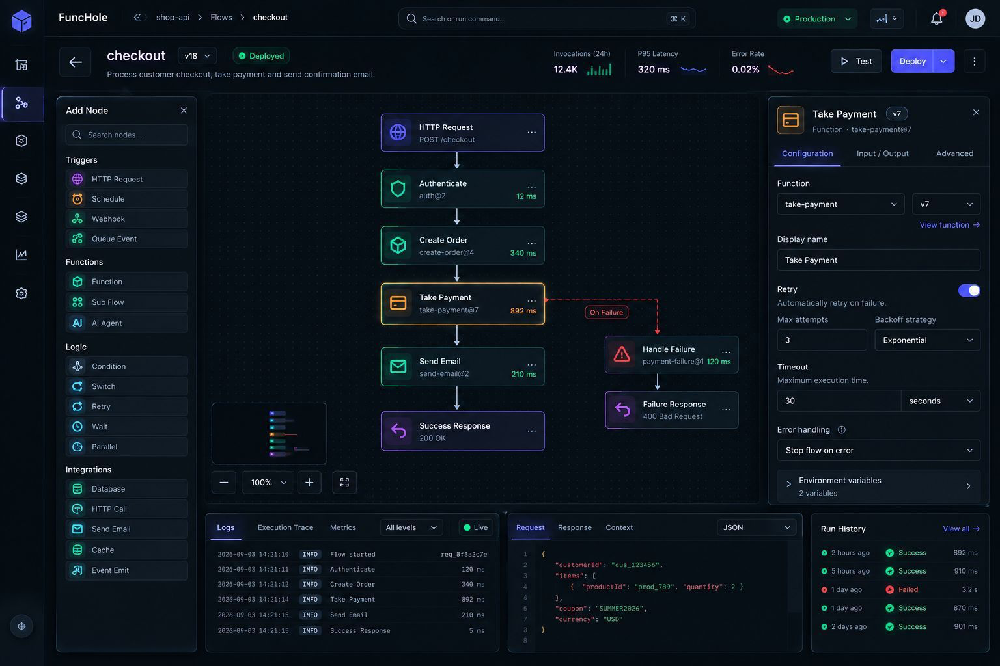

# FuncHole 

FuncHole is an open-source, self-hosted platform for gateway-hosted function execution. This repository contains the backend foundation for the platform: management APIs, HTTPS ingress, certificate lifecycle, and the early execution architecture.



> Wireframe only. The image above is a product-direction screenshot, not the current shipped interface.

## Overview

FuncHole is being shaped around a simple request model:

```text
https://<gateway-key>.<domain>/<path>
```

Example:

```text
https://gw1.example.com/orders
```

The hostname belongs to the gateway. Functions and future flows are resolved under that gateway by path.

## Current Status

As of September 4, 2026, the backend is still in active foundation work. Core pieces are already running, but the platform is not feature-complete yet.

Implemented today:

* Spring Boot `controlplane` for management APIs
* raw Netty `gateway` for HTTPS ingress
* Flyway-managed PostgreSQL schema
* JWT-based authentication
* domain creation and TXT-based verification
* gateway creation under verified domains
* shared certificate module
* self-signed certificate generation for local development
* OpenBao-backed secret storage for certificate material
* in-memory gateway TLS registry with short polling refresh

Not implemented yet:

* flow routing
* invocation orchestration
* runtime execution
* production ACME / Let's Encrypt flow
* automatic host-machine DNS setup for custom local domains

## Why FuncHole

Most serverless platforms tightly couple deployment, routing, runtime behavior, and infrastructure ownership to a single provider.

FuncHole is exploring a different model:

* self-hosted
* gateway-first
* path-based function exposure under stable gateway hosts
* framework-independent shared modules where practical
* explicit boundaries between management, ingress, invocation, and runtime

## Architecture At A Glance

```text
Controlplane -> owns auth, domains, gateways, certificates, metadata
Gateway      -> serves HTTPS, resolves host, normalizes request, returns gateway response
Invocation   -> future orchestration and dispatch layer
Runtime      -> future execution layer
```

More detailed architecture notes live in [docs/architecture.md](/Users/rafsan/Workspare/FuncHole/backend/docs/architecture.md).

## Repository Layout

```text
funchole/
├── certificate/
├── controlplane/
├── core/
├── docker/
├── docs/
├── gateway/
├── invocation/
├── runtime/
├── Dockerfile
├── docker-compose.yml
├── docker-compose.dev.yml
└── image.png
```

## Modules

| Module | Responsibility |
| --- | --- |
| `certificate` | Framework-independent certificate contracts, models, and generators |
| `controlplane` | Spring Boot management API |
| `core` | Shared pagination, exception, response, and mapper concerns |
| `gateway` | Standalone raw Netty HTTPS ingress service |
| `invocation` | Future invocation/orchestration layer |
| `runtime` | Future execution/runtime layer |

## Technology Stack

| Area | Technology |
| --- | --- |
| Language | Java 25 |
| Build | Gradle |
| Controlplane | Spring Boot 4.1.1 |
| Gateway | Raw Netty |
| Database | PostgreSQL 17 |
| Migration | Flyway |
| Secret management | OpenBao |
| Authentication | Spring Security + JWT |
| API docs | Springdoc OpenAPI |
| Mapping | MapStruct |
| Logging | Log4j2 in `controlplane`, SLF4J Simple in `gateway` |
| Testing | JUnit + Testcontainers |
| Local infrastructure | Docker Compose |

## Quick Start

Recommended local development flow:

```bash
docker compose -f docker-compose.dev.yml up --build
```

Local service endpoints:

| Service | Address |
| --- | --- |
| Controlplane | `http://localhost:7080` |
| Gateway | `https://localhost` |
| PostgreSQL | `localhost:5432` |
| OpenBao | `http://localhost:8200` |
| Technitium DNS UI | `http://localhost:5380` |

Useful checks:

```bash
curl http://localhost:7080/actuator/health
curl http://localhost:7080/api/v1/system/ping
curl -k https://localhost/health
```

More setup and local workflow details live in [docs/development.md](/Users/rafsan/Workspare/FuncHole/backend/docs/development.md).

## Documentation

Project docs:

* [docs/architecture.md](/Users/rafsan/Workspare/FuncHole/backend/docs/architecture.md)
* [docs/development.md](/Users/rafsan/Workspare/FuncHole/backend/docs/development.md)
* [contribute.md](/Users/rafsan/Workspare/FuncHole/backend/contribute.md)

## Local Development Notes

Important current behavior:

* `gateway` starts after `controlplane` is healthy, because Flyway runs in `controlplane`
* `gateway` serves HTTPS on port `443` in development to keep the URL shape production-like
* development certificates are self-signed, so browser trust warnings are expected unless you trust the cert or issuing CA
* OpenBao now uses persistent local storage in Docker instead of in-memory dev mode
* custom local domains still require the host machine to resolve them correctly

## Contribution

Please read [contribute.md](/Users/rafsan/Workspare/FuncHole/backend/contribute.md) before making architectural or persistence-related changes.

## Project Direction

The intended module direction remains:

```text
com.funchole.backend
├── controlplane
├── gateway
├── invocation
└── runtime
```

The current focus is to stabilize the backend foundation before pushing into flow execution and runtime orchestration.
