# Architecture

This document keeps the deeper conceptual backend architecture notes that do not need to stay on the front page.

## High-Level Model

FuncHole is being designed around four major backend areas:

```text
Controlplane -> What should exist?
Gateway      -> Where should a request go?
Invocation   -> What immutable execution graph should run?
Runtime      -> Where and how should a component execute?
```

At a high level:

```text
Internet
   ↓
Gateway
   ↓
Invocation Registry
   ↓
Event Bus
   ↓
Invocation Dispatcher
   ↓
Runtime Registry
   ↓
IPC
   ↓
Runtime / Artifact
   ↓
Function / Component
```

Core principle:

> Global coordination is event-driven; local execution is IPC-driven.

Event Bus and IPC solve different problems. The Event Bus coordinates distributed components globally. IPC remains the optimized local execution path once runtime capacity has been selected or prepared.

```mermaid
flowchart LR
    gateway["Gateway"]
    invocationRegistry["Invocation Registry"]
    eventBus["Event Bus"]
    dispatcher["Invocation Dispatcher"]
    runtimeRegistry["Runtime Registry"]
    ipc["IPC"]
    runtime["Runtime / Artifact"]

    gateway -->|"Flow identity"| invocationRegistry
    invocationRegistry -->|"Frozen invocation graph"| eventBus
    eventBus --> dispatcher
    dispatcher -->|"Next step + runtime requirement"| runtimeRegistry
    runtimeRegistry -->|"Prepared local target"| ipc
    ipc --> runtime
```



The Event Bus is not introduced as a replacement for IPC. IPC is not intended to become the global distributed communication mechanism.

## Responsibility Summary

| Area | Responsibility |
| --- | --- |
| Gateway | Resolve the incoming host, method, and path to the Flow that should be invoked. |
| Invocation Registry | Capture the exact immutable Flow/dependency graph for a specific invocation. |
| Invocation Dispatcher | Decide what executes next, what input it needs, and where execution should be scheduled. |
| Runtime Registry | Identify available runtime capacity and prepare the required runtime/artifact. |
| Event Bus | Coordinate distributed components globally without tight service coupling. |
| IPC | Carry efficient local execution communication between runtime-facing code and prepared runtimes/artifacts. |

The current implementation has only the Gateway-side Flow seam. Invocation Registry, Event Bus, Invocation Dispatcher, Runtime Registry, and runtime behavior are future design and implementation work.

## Controlplane

The `controlplane` is the management backend of FuncHole.

Current and planned responsibilities:

* authentication and authorization
* app user management
* domain ownership and verification
* gateway management
* certificate provisioning
* configuration and metadata ownership
* future function and deployment management

Technology:

* Spring Boot
* Spring Security
* JWT
* Flyway
* PostgreSQL
* OpenAPI

The `controlplane` owns metadata. It is not the request-serving edge.

## Gateway

The `gateway` is a standalone Java service built on raw Netty.

Its responsibilities are intentionally different from `controlplane`:

* accept HTTPS traffic
* terminate TLS
* resolve SNI and `Host`
* identify the target gateway host
* normalize request method and path
* route toward future flow or function layers
* return gateway-level fallback responses when no flow exists yet

The `gateway` should remain lightweight and runtime-facing. It should not become a Spring Boot application.

## Request Model

The public-facing request model is:

```text
https://<gateway-key>.<domain>/<path>
```

Example:

```text
https://gw1.example.com/orders
```

This means:

* the gateway host is derived from gateway identity plus domain ownership
* function or flow resolution happens beneath that host by path
* there is no need to issue a new DNS record or certificate per function path

## Domain and Gateway Identity

FuncHole separates domain ownership from gateway identity.

Conceptually:

```text
app_domain + gateway.unique_key = gateway hostname
```

Example:

```text
domain      = example.com
gateway_key = gw1
hostname    = gw1.example.com
```

That hostname is the public namespace for traffic under that gateway.

## Certificate Model

Certificates belong to gateway hosts, not to individual functions.

Example:

```text
gateway host = gw1.example.com
```

Then requests like:

```text
gw1.example.com/orders
gw1.example.com/billing/webhook
gw1.example.com/functions/f12344
```

can all be covered by the same gateway certificate.

Current direction:

* PostgreSQL stores certificate metadata and `secret_ref`
* OpenBao stores the actual certificate bundle and private key
* `controlplane` provisions certificates
* `gateway` loads active certificate bundles and converts them into Netty `SslContext`

## Shared Certificate Boundary

The `certificate` module is intentionally framework-independent.

That means:

* no Spring annotations in the shared certificate module
* no Netty-specific return types in the shared certificate module

Good boundary:

```java
public record CertificateBundle(
    byte[] certificateChain,
    byte[] privateKey
) {}
```

Bad boundary:

```java
SslContext
```

`SslContext` is a gateway concern, not a shared certificate concern.

## Storage Boundary

FuncHole currently separates metadata from secret material:

### PostgreSQL

Stores:

* users
* domains
* gateways
* certificate metadata
* secret references

### OpenBao

Stores:

* certificate PEM data
* private keys
* future secret material

This boundary helps keep sensitive data out of ordinary application tables.

## Runtime Direction

`invocation` and `runtime` are still placeholders, but their intended direction is:

```text
Gateway
   ↓
Invocation Registry
   ↓
Event Bus
   ↓
Invocation Dispatcher
   ↓
Runtime Registry
   ↓
IPC
   ↓
Runtime / Artifact
   ↓
Function
```

Planned responsibilities:

### Invocation Registry

* invocation creation
* immutable dependency graph capture
* pinned Flow, Sub-Flow, and component versions
* invocation state persistence

### Invocation Dispatcher

* execution coordination
* next-step resolution
* step input resolution
* runtime capacity requests
* final result resolution

### Runtime Registry

* runtime capacity discovery
* runtime and artifact preparation
* runtime health and warmness tracking

### Runtime / Artifact

* local component execution

Future concerns:

* synchronous invoke
* asynchronous dispatch
* permission checks
* trace propagation
* environment injection
* isolation
* timeout and resource control

Exact event schemas, broker technology, retry policies, scheduling algorithms, and persistence structures are intentionally unresolved future design work.

## Framework Boundary Rule

One of the main architecture rules in this project is:

> Frameworks should stay at application boundaries.

In practice:

* Spring Boot belongs in `controlplane`
* Netty belongs in `gateway`
* shared modules should remain framework-independent when practical

This keeps the project easier to evolve as the platform grows.
